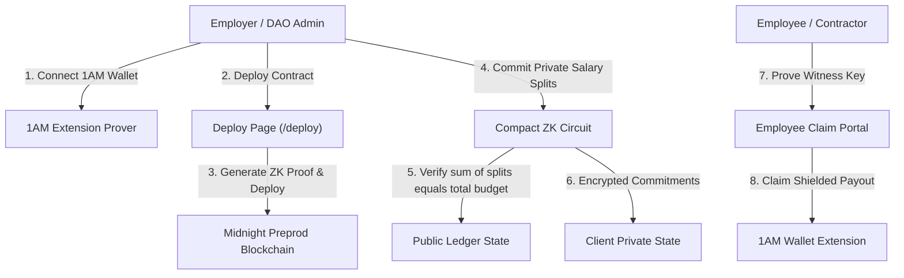

# Product Proposal: Private Payroll & Splits on Midnight Network (1AM Preprod)

## Executive Summary
**Private Payroll / Splits** is a zero-knowledge confidential fund distribution application designed for web3 organizations, DAOs, companies, and freelancers. Built on the **Midnight Network** (Preprod Network) using the **Compact / Minokawa** smart contract language, it enables organizations to disburse funds and execute salary splits without exposing recipient wallet identities or individual compensation figures on a public blockchain ledger.

- 🌐 **Live Deployed App**: [lev3-midnight-private-splits.vercel.app](https://lev3-midnight-private-splits.vercel.app/)
- 🎥 **Demo Video Walkthrough**: [Watch Video Demo on Google Drive](https://drive.google.com/file/d/1tNRzXDj9ZfjGCkL7-EgZPqYm-2ZupTN7/view?usp=sharing)
- 💻 **GitHub Repository**: [github.com/vatsakash/lev3-Midnight-private-splits](https://github.com/vatsakash/lev3-Midnight-private-splits)

### 📸 Application & Deployment Screenshots


---

## 🛠️ Tech Stack & Tooling

| Layer | Technology | Details |
| :--- | :--- | :--- |
| **Smart Contract** | Compact v0.23 | Minokawa ZK Proving System |
| **Blockchain** | Midnight Preprod Network | Network ID: `preprod` |
| **SDK & Connector** | Midnight.js SDK | `@midnight-ntwrk/dapp-connector-api` |
| **Browser Wallet** | 1AM / Lace Extension | 100% In-Browser Prover & Transaction Provider |
| **Frontend Framework** | React 18 + TypeScript | Vite 6 Build Engine |
| **Design & UI** | Tailwind CSS + Lucide Icons | Glassmorphism Electric Indigo & Cyan Theme |
| **Testing** | Vitest | 4 Unit & ZK Privacy Tests Passing |
| **CI/CD & Hosting** | GitHub Actions + Vercel | Automated Build, Test & Deployment |

---

## 🏛️ System Architecture



---

## 🔒 Privacy Flow: Step-by-Step State Model

1. **Batch Initialization**: Employer specifies the public total budget on-chain (e.g. `50,000 tNIGHT`).
2. **Confidential Allocation**: Employer creates private split commitments in client private state. The Compact ZK circuit enforces that the sum of all individual payouts equals the total budget (`sum(splits) == total_budget`) without exposing individual salary figures.
3. **Batch Finalization**: Locking batch commitment hash into ledger state.
4. **Zero-Knowledge Claim**: Employee proves ownership of their secret witness key inside the ZK circuit, claiming payouts directly into their 1AM wallet without exposing compensation figures to co-workers.
5. **Auditor Selective Disclosure**: Compliance audit circuit (`disclose_payroll_audit`) allows authorized auditors to verify budget equality without de-anonymizing employee identities.

---

## 📂 Project Structure

```
lev3-Midnight-private-splits/
├── .github/
│   └── workflows/
│       └── ci.yml                 # Automated CI/CD pipeline (lint, test, build)
├── contracts/
│   └── PrivatePayroll.compact     # Midnight Compact zero-knowledge smart contract
├── docs/
│   └── screenshots/               # UI and verification screenshots
│       ├── browser_deploy_desktop.png
│       ├── browser_deploy_mobile.png
│       ├── ci_cd_vercel_checks.png
│       └── vitest_test_output.png
├── src/
│   ├── components/
│   │   ├── AdminPayroll.tsx       # Employer batch management UI
│   │   ├── AuditDisclosure.tsx    # Selective disclosure compliance audit view
│   │   ├── CircuitLogsModal.tsx   # ZK proof log inspector modal
│   │   ├── ContractDeploy.tsx     # 1AM browser contract deployment (/deploy)
│   │   ├── DeveloperIntegrationGuide.tsx # Integration diagnostics suite
│   │   ├── EmployeeClaim.tsx      # Employee private payout claim portal
│   │   ├── Navbar.tsx             # Wallet connector & tab navigation header
│   │   └── PreprodExplorer.tsx    # Midnight Preprod network inspector
│   ├── midnight/
│   │   ├── browserDeployer.ts     # 1AM in-browser contract deployment engine
│   │   ├── dappConnector.ts       # Midnight.js DApp connector & 1AM wallet manager
│   │   ├── payrollSimulator.ts    # Compact circuit execution simulator
│   │   └── types.ts               # TypeScript types and interfaces
│   ├── App.tsx                    # Main application router and state manager
│   ├── index.css                  # Tailwind styles & Electric Indigo/Cyan theme
│   └── main.tsx                   # React entry point
├── tests/
│   └── PrivatePayroll.test.ts     # Vitest suite covering Compact circuits & ZK model
├── index.html                     # HTML template with Plus Jakarta Sans & JetBrains Mono
├── package.json                   # Project dependencies and script runner
├── postcss.config.js              # PostCSS configuration
├── PRODUCT_PROPOSAL.md            # Product proposal & architectural specification
├── README.md                      # Primary project documentation
├── tailwind.config.js             # Tailwind CSS configuration with extended theme
├── tsconfig.json                  # TypeScript compiler options
└── vercel.json                    # Vercel SPA routing configuration
```

---

## The Problem
Standard public blockchains (Ethereum, Solana, Cardano) publish all transaction data on-chain. When a company or DAO pays salaries or splits project revenue on-chain:
1. **Compromised Employee Privacy**: Competitors, colleagues, and public observers can inspect exact salary amounts.
2. **Security & Targeting Risks**: High earners become targets for phishing, social engineering, and extortion.
3. **Operational Friction**: Companies resort to centralized off-chain workarounds or complex custodian setups to preserve financial privacy.

---

## The Solution: Midnight ZK Privacy Model
**Private Payroll / Splits** leverages Midnight's dual-state architecture (Public Ledger + Local Private State) and zero-knowledge circuit execution:
- **Public Ledger**: Only records the total budget, batch hash commitment, and total recipient count.
- **Private State & Witnesses**: Individual recipient salaries, Bech32m addresses, and split ratios remain on the employee's local device.
- **Selective Disclosure**: Auditors can verify budget conservation (`sum(splits) == total_budget`) without revealing individual employee compensation.

---

## Product Features & User Flows

### 1. Employer Dashboard
- Initialize payroll batch with total budget in tNIGHT.
- Add private employee salary commitments.
- Real-time ZK budget conservation proof generation (`current_sum + split <= total_budget`).
- Batch finalization to lock commitments.

### 2. Employee Claim Portal
- View encrypted entitlement commitments.
- Generate local zero-knowledge proof of entitlement using employee secret key.
- Claim private payout directly into 1AM wallet without revealing salary amount to co-workers.

### 3. Auditor Selective Disclosure
- Execute compliance audit circuit (`disclose_payroll_audit`).
- Verify total budget equality without de-anonymizing recipient identities or amounts.

---

## Target Audience
- Web3 Native Companies & Ecosystem Foundations
- Decentralized Autonomous Organizations (DAOs)
- Freelance Agencies & Revenue Sharing Pools

---

## Roadmap & Preprod Deployment
- **Preprod Smart Contract Address**: `0b25eecb7a0d69b70f20e79c9213c06e45aad14cd3db6888a59fd052a78b58b0`
- **GraphQL Indexer**: `https://indexer.preprod.midnight.network/api/v4/graphql`
- **Node RPC**: `https://rpc.preprod.midnight.network`
- **Phase 1 (Complete)**: Compact contract, 1AM wallet connector, ZK simulator, full UI, Vitest suite, and GitHub CI/CD on Preprod network.
- **Phase 2 (Future)**: Multi-token support (NATIVE + Custom ZK Assets), scheduled recurring payroll streams.
