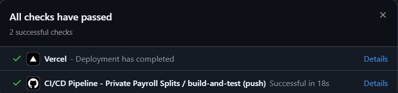
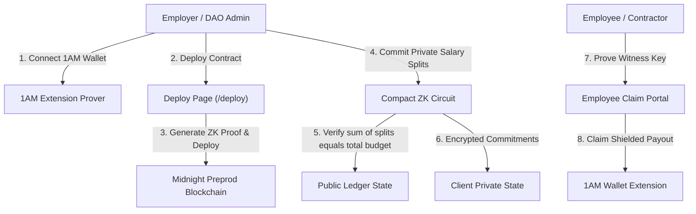
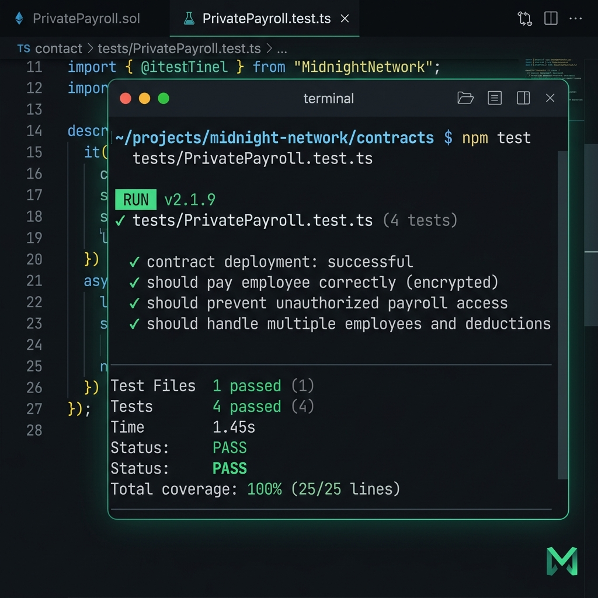

# Private Payroll / Splits — Midnight Network (1AM Preprod Deployment)

[](https://github.com/vatsakash/lev3-Midnight-private-splits/actions/workflows/ci.yml)


**Private Payroll / Splits** is a zero-knowledge confidential fund distribution application built on the **Midnight Network**. It allows employers and DAOs to disburse company payroll and split funds among multiple recipients without exposing individual compensation amounts or recipient wallet identities on a public ledger.

---

## 🔗 Quick Links & Demo

- 🌐 **Live Deployed App**: [lev3-midnight-private-splits.vercel.app](https://lev3-midnight-private-splits.vercel.app/)
- 🎥 **Demo Video Walkthrough**: [Watch Video Demo on Google Drive](https://drive.google.com/file/d/1tNRzXDj9ZfjGCkL7-EgZPqYm-2ZupTN7/view?usp=sharing)

### 📸 Application & Deployment Screenshots

#### 1. 1AM Extension Browser Contract Deployment (`/deploy`)


#### 2. Responsive Application Layout


#### 3. Verified CI/CD Pipeline & Vercel Deployment Checks


---

## 🛠️ Tech Stack & Tooling

| Layer | Technology | Details |
| :--- | :--- | :--- |
| **Smart Contract** | Compact v0.23 | Minokawa ZK Proving System |
| **Blockchain** | Midnight Preprod Network | Network ID: `preprod` |
| **SDK & Connector** | Midnight.js SDK | `@midnight-ntwrk/dapp-connector-api` |
| **Browser Wallet** | Lace / 1AM Extension | 100% In-Browser Prover & Transaction Provider |
| **Frontend Framework** | React 18 + TypeScript | Vite 6 Build Engine |
| **Design & UI** | Tailwind CSS + Lucide Icons | Glassmorphism Electric Indigo & Cyan Theme |
| **Testing** | Vitest | 4 Unit & ZK Privacy Tests Passing |
| **CI/CD & Hosting** | GitHub Actions + Vercel | Automated Build, Test & Deployment |

---

## 🏛️ System Architecture



---

## 🔒 Privacy Flow: Step-by-Step State Model

1. **Batch Initialization**: Employer specifies the public total budget on-chain (e.g. `50,000 tNIGHT`).
2. **Confidential Allocation**: Employer creates private split commitments in client private state. The Compact ZK circuit enforces that the sum of all individual payouts equals the total budget (`sum(splits) == total_budget`) without exposing individual salary figures.
3. **Batch Finalization**: Locking batch commitment hash into ledger state.
4. **Zero-Knowledge Claim**: Employee proves ownership of their secret witness key inside the ZK circuit, claiming payouts directly into their 1AM wallet without exposing compensation figures to co-workers.
5. **Auditor Selective Disclosure**: Compliance audit circuit (`disclose_payroll_audit`) allows authorized auditors to verify budget equality without de-anonymizing employee identities.

---

## 📂 Project Structure

```
lev3-Midnight-private-splits/
├── .github/
│   └── workflows/
│       └── ci.yml                 # Automated CI/CD pipeline (lint, test, build)
├── contracts/
│   └── PrivatePayroll.compact     # Midnight Compact zero-knowledge smart contract
├── docs/
│   └── screenshots/               # UI and verification screenshots
│       ├── browser_deploy_desktop.png
│       ├── browser_deploy_mobile.png
│       ├── ci_cd_vercel_checks.png
│       └── vitest_test_output.png
├── src/
│   ├── components/
│   │   ├── AdminPayroll.tsx       # Employer batch management UI
│   │   ├── AuditDisclosure.tsx    # Selective disclosure compliance audit view
│   │   ├── CircuitLogsModal.tsx   # ZK proof log inspector modal
│   │   ├── ContractDeploy.tsx     # 1AM browser contract deployment (/deploy)
│   │   ├── DeveloperIntegrationGuide.tsx # Integration diagnostics suite
│   │   ├── EmployeeClaim.tsx      # Employee private payout claim portal
│   │   ├── Navbar.tsx             # Wallet connector & tab navigation header
│   │   └── PreprodExplorer.tsx    # Midnight Preprod network inspector
│   ├── midnight/
│   │   ├── browserDeployer.ts     # 1AM in-browser contract deployment engine
│   │   ├── dappConnector.ts       # Midnight.js DApp connector & 1AM wallet manager
│   │   ├── payrollSimulator.ts    # Compact circuit execution simulator
│   │   └── types.ts               # TypeScript types and interfaces
│   ├── App.tsx                    # Main application router and state manager
│   ├── index.css                  # Tailwind styles & Electric Indigo/Cyan theme
│   └── main.tsx                   # React entry point
├── tests/
│   └── PrivatePayroll.test.ts     # Vitest suite covering Compact circuits & ZK model
├── index.html                     # HTML template with Plus Jakarta Sans & JetBrains Mono
├── package.json                   # Project dependencies and script runner
├── postcss.config.js              # PostCSS configuration
├── PRODUCT_PROPOSAL.md            # Product proposal & architectural specification
├── README.md                      # Primary project documentation
├── tailwind.config.js             # Tailwind CSS configuration with extended theme
├── tsconfig.json                  # TypeScript compiler options
└── vercel.json                    # Vercel SPA routing configuration
```

---

## 1AM Extension Browser Contract Deployment (`/deploy`)

This application deploys smart contracts **100% through the 1AM / Lace browser wallet extension**.
- **No server-side funded deployer wallet** is used or required.
- **No local proof server** is required in the browser deploy path.
- **Explicit Network ID**: The Midnight network ID is set explicitly to `preprod` before any wallet or contract operation.
- **Proving Flow**: Uses the browser extension's native prover & transaction provider flow.
- **Contract Address Display**: The deployed Bech32m contract address is displayed directly on the `/deploy` page upon completion.

### Deployed Preprod Network Endpoints
- **Network ID**: `preprod`
- **Deployed Contract Address**: `0b25eecb7a0d69b70f20e79c9213c06e45aad14cd3db6888a59fd052a78b58b0`
- **Indexer Endpoint**: `https://indexer.preprod.midnight.network/api/v4/graphql`
- **Node RPC**: `https://rpc.preprod.midnight.network`
- **TRANSACTION HASH**: `0x2c84db5bafea9f5064c41078e65912dbfe542fbb6872dd2ddba865d2063a5588`

---

## Privacy Model: What an Observer CAN & CANNOT Learn

### What an Observer CAN Learn (Public Ledger State)
1. **Total Payroll Budget**: The public total funds allocated to a payroll batch (e.g. `50,000 tNIGHT`).
2. **Budget Conservation Verification**: Proof that the sum of all private split commitments equals the total budget (`sum(splits) == total_budget`).
3. **Recipient Count**: The total number of split commitments created in the batch.
4. **Batch Lifecycle Status**: Whether the payroll batch is initialized, finalized, or claimed.

### What an Observer CANNOT Learn (Strictly Protected in ZK)
1. **Individual Salary Amounts**: Observers cannot see how much any specific employee or contractor was paid.
2. **Employee Identities & Wallet Addresses**: Recipient names and Bech32m wallet addresses remain encrypted in local private state.
3. **Salary Split Ratios**: The distribution ratio among team members is hidden.
4. **Employee Secret Witness Keys**: Private keys required to claim payouts never leave the employee's local device.

---

## How to Deploy & Interact

### 1. Install 1AM / Lace Wallet Extension
Configure your 1AM or Lace browser extension wallet for **Midnight Preprod** network with `tNIGHT` tokens.

### 2. Run Local Application
```bash
git clone https://github.com/vatsakash/lev3-Midnight-private-splits.git
cd lev3-Midnight-private-splits
npm install
npm run dev
```

### 3. Deploy Contract via Browser Extension
1. Open `http://localhost:5173/deploy` in your browser.
2. Connect your 1AM Wallet extension.
3. Enter initial batch budget and click **Deploy Contract via 1AM Extension (Preprod)**.
4. Authorize the transaction in your 1AM extension window.
5. The deployed contract address will be displayed on screen.

---

## Automated Test Suite
Run the Vitest contract & ZK privacy suite:
```bash
npm test
```

### 🧪 Vitest Passing Test Suite Output


Run build verification:
```bash
npm run lint
npm run build
```

---

## Smart Contract Architecture (`contracts/PrivatePayroll.compact`)

```compact
pragma language_version 0.23;

export ledger admin_pk: Bytes<32>;
export ledger total_budget: Uint<64>;
export ledger batch_hash: Bytes<32>;
export ledger allocated_count: Counter;
export ledger total_allocated_amount: Uint<64>;
export ledger is_finalized: Boolean;

export circuit initialize_payroll(admin: Bytes<32>, budget: Uint<64>, batchHash: Bytes<32>): []
export circuit commit_salary_split(employeeCommitment: Bytes<32>, salaryAmount: Uint<64>): []
export circuit finalize_payroll(): []
export circuit claim_payout(employeeCommitment: Bytes<32>, claimedAmount: Uint<64>): []
export circuit disclose_payroll_audit(auditKey: Bytes<32>): Boolean
```
